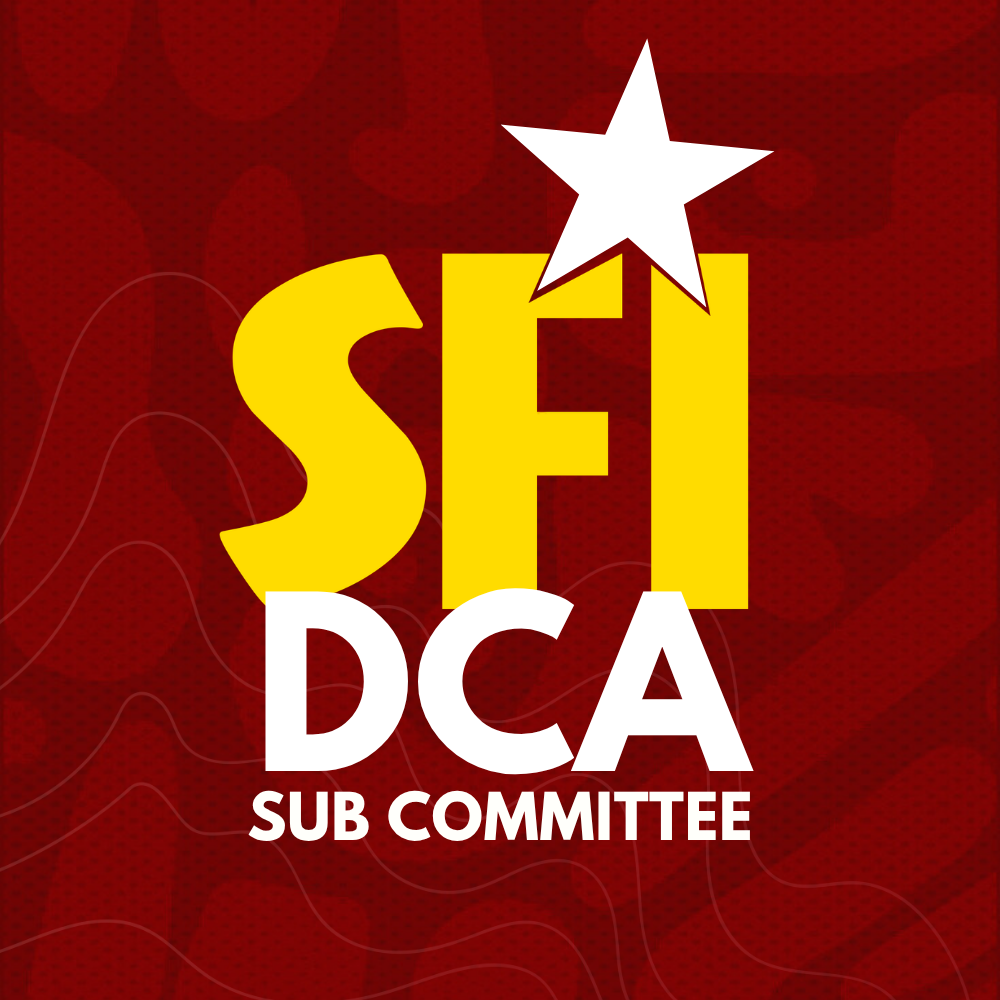

# DCA-Pedia | Academic Resources 📚

<p align="center">
  
</p>

<p align="center">
  
  
  
  
</p>

---

**DCA-Pedia** is a centralized platform for accessing and downloading academic PDFs, notes, and study materials for students of the Department of Computer Applications (DCA).

## 🚀 Programs Covered
- **MSc AI/DS**: Master of Science in Artificial Intelligence & Data Science
- **MCA**: Master of Computer Applications
- **Integrated MCA**: Integrated Master of Computer Applications

---

## 🤝 How to Contribute

We welcome contributions! To add new academic resources or improve the platform, please follow these steps:

### 1. Create a New Branch
Always create a **new branch** for your contributions:
```bash
git checkout -b feature/your-feature-name
```

### 2. Add New Files
Place your PDF files in the appropriate directory:
- **MSc AI/DS**: `static/pdfs/Msc AI-DS/`
- **MCA**: `static/pdfs/MCA/`
- **Integrated MCA**: `static/pdfs/Integrated MCA/`

### 3. Update the Manifest
Run the automated script to update the file database (`data/pdfs.js`):
```powershell
python generate_manifest.py
```

### 4. Submit a Pull Request
Push your changes to your branch and open a Pull Request for review.

---

## 🛠 Developed By
This project is developed and maintained by **SFI DCA SUB COMMITTEE**.

---

## 📜 Usage Policy
This repository is maintained strictly for **educational purposes** to support current and future students.
